お店の情報を登録しよう! OpenStreetMapはじめてガイド
======

**みんなでテイクアウトMAP**は、みんなで編集できるみんなの地図**[OpenStreetMap](https://www.openstreetmap.org/)**のデータに基づいています。

地元のお店やお気に入りのお店の情報が不足していたり間違っていたりしたら、だれでも変更することができます。お店自体が登録されていなくても、今すぐ登録することができます。一般的なWebブラウザで簡単にできますので、ぜひこの機会にOpenStreetMapを編集してみませんか?
OpenStreetMapを編集するにはアカウントを持っている必要があります。アカウントは誰でも作成することができます。

* [OpenStreetMapのアカウントを**持っている**方はこちらからスタート](#register)
* [OpenStreetMapのアカウントを**持っていない**方はこちらからスタート](#login)

アカウントの作成
------
OpenStreetMapのアカウントをお持ちでない方は、[ユーザ登録ページ](https://www.openstreetmap.org/user/)で登録を行ってください。メールアドレスや表示名 (OpenStreetMap上で表示されるあなたの名前です) を入力すると、登録したメールアドレス宛にメールが届きますので、メールの内容に従って登録を完了させてください。

その他のSNSなど外部アカウントとの連携も可能ですので、 (TODO: 参考ページ)

ログイン
------
すでにOpenStreetMapのアカウントをお持ちの場合は、[ログインページ](https://www.openstreetmap.org/login)からログインします。

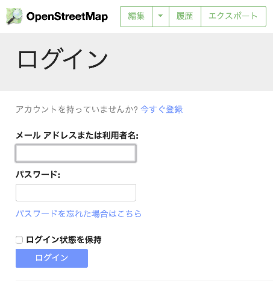

編集する
------
お店のある地域にズームインします。

地図を動かしながらズームインしていくこともできます。
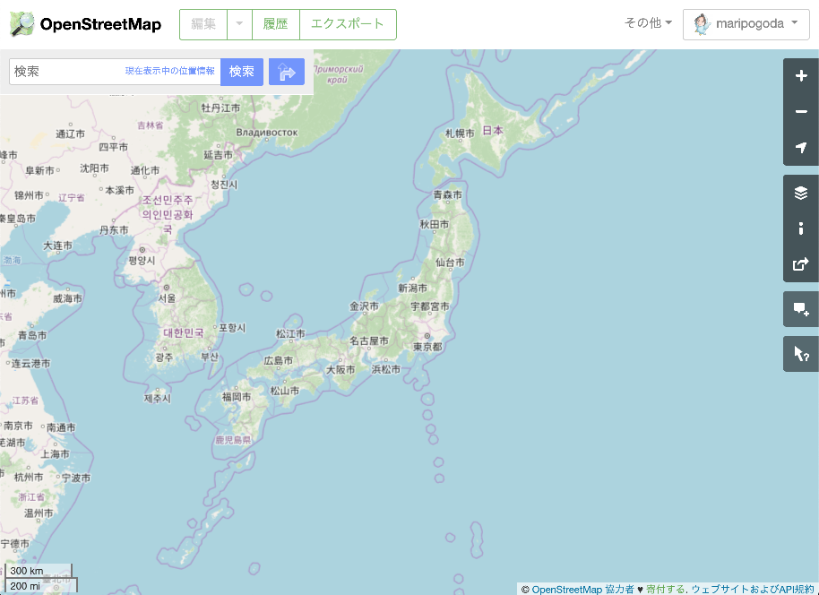

左上の検索ボックスに住所や駅名などを入れると検索できます。
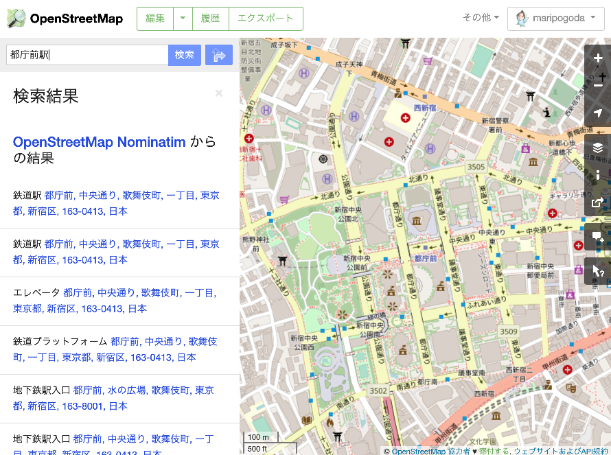

お店のあるエリアが表示されたらいよいよ編集開始です。画面のいちばん上にある「編集」を選びます。初めてでもすぐに使える「iD (ブラウザー内エディター) で編集」を選びます。

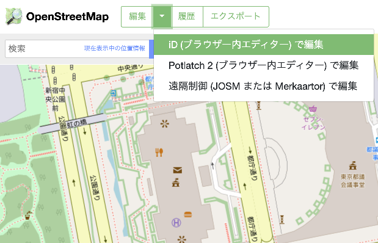

ブラウザー内エディター「iD」が起動します。起動には少し時間がかかる場合があります。起動が完了すると、航空写真の上に道路や建物や施設の情報が表示されます。

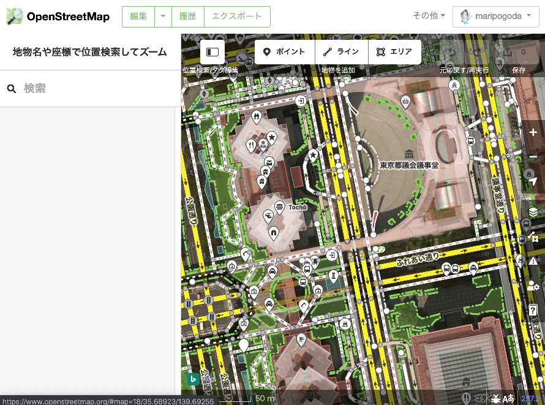

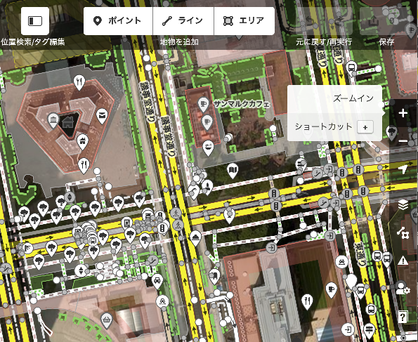
地図の右に表示される「+」「-」ボタンを使い、店舗を追加したい位置に向かってズームしたら、編集準備完了です。

* [**お店自体を登録する**ところからスタートする場合](#add)
* [**お店の情報を編集する**場合](#edit)

新しいお店を登録
------
画面上のメニューから「ポイント」を選びます。

白いピンが立ち、赤く点滅し、左に地物 (地図上のモノのことをこう呼びます) の種類を選択する画面が現れますので、追加したいお店の種類を選んでください。
地物の種類はたくさんありますので、虫眼鏡アイコンのあるテキストボックスで絞り込むのがおすすめです。

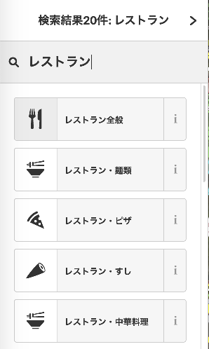

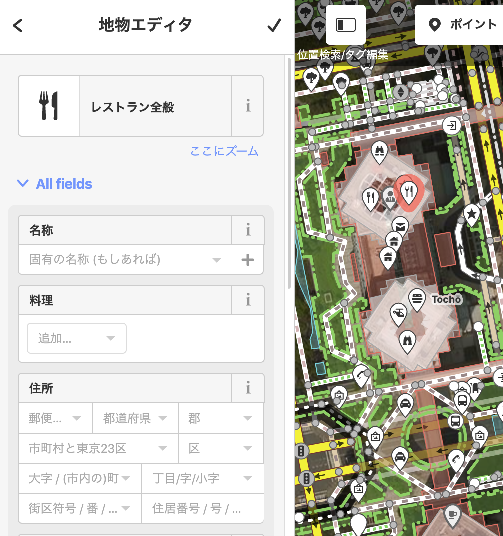

どれに分類するか曖昧な場合は、あまり悩まずに最も近そうなものを選べばOKです。よく使われる分類は以下のようなものがあります。

* レストラン : 食事のできるお店。
* ファストフード : すばやく食事を済ませることができる比較的低価格なお店。ハンバーガーやピザなど、細かい分類もあります。
* 喫茶店 : ノンアルコールの飲み物がメインのカフェなど。
* 居酒屋 : お酒と食べ物を提供するお店。
* バー : お酒をメインとするお店。

選択したいお店の種類がグレーで表示され、「ポイントが非表示となっています。ズームインして有効化してください。」と表示される場合、ズームが足りません。地図の右にある「+」「-」ボタンでズームインしてください。
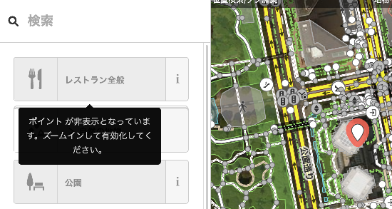

「名称」の欄に、お店の名前を記入します。
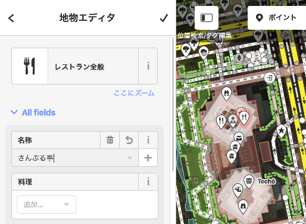

お店の情報を編集する
------
お店をクリックします。

OpenStreetMapでは、お店の色々な情報を登録することができます。
たとえば営業時間や料理のジャンル、そしてテイクアウトやデリバリーの情報などなど。

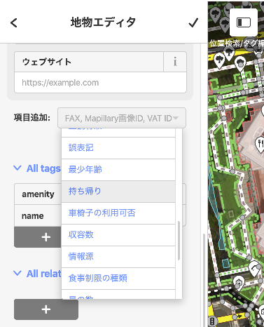

「可能」「不可能」「持ち帰りのみ」の選択肢が表示されますので、該当するものを選んでください。
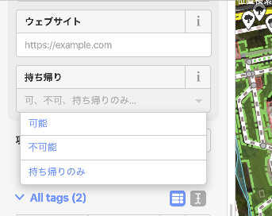

これで「このお店はお持ち帰りが可能」という情報が入力できました。

配達の可否も同様に入力することができます。こちらはチェックボックスで選択する方式になっています。

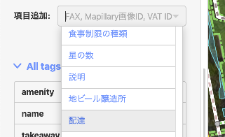

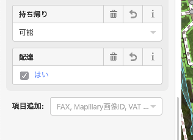

コミット
------
うまく編集できましたか? この時点ではまだ、変更した内容はOpenStreetMapに反映されていません。
**コミット**することによって、全世界に向けて情報を発信することができます。

画面右上の「コミット」をクリックします。
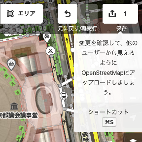

コミットする際には、「何を変更したのか」を「コミットメッセージ」として添えます。
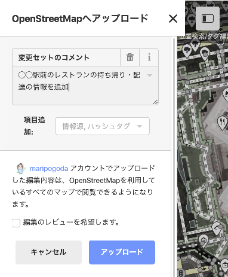

この内容でOK! と思ったら、「アップロード」をクリック。これで変更内容がOpenStreetMapのサーバに送信され、しばらくすると全世界に公開されます。そのうちみんなでテイクアウトMAPにも反映されます。おめでとうございます! OpenStreetMapデビューに成功です!

OpenStreetMapにもっと参加したいと思ったら
------
ここでは、お店をひとつ追加したり、お店のお持ち帰りや配達の情報を記入したりする方法を紹介しました。
OpenStreetMapの情報を編集する人のことを**マッパー**といいます。お店をひとつ編集したらあなたはマッパーとして世界デビューを果たしたことになります。

TODO
